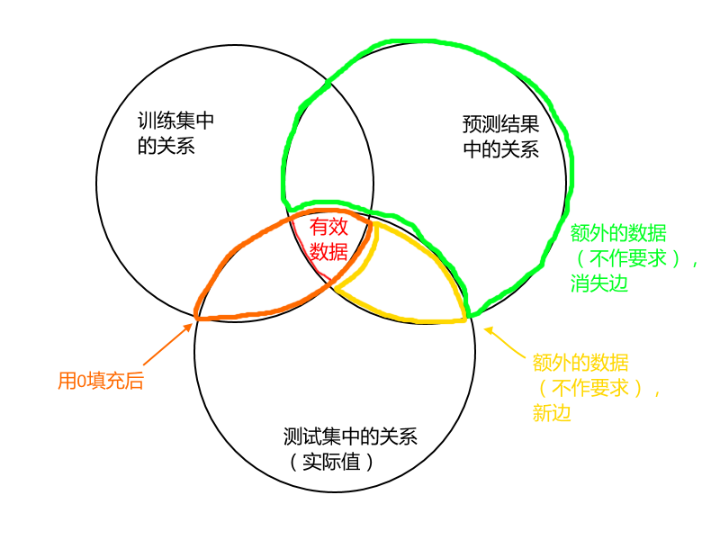

  
**第六届“中国软件杯”大学生软件设计**

**民航机票代理市场的预测及可视化**  

   
队  名:  fly me to sky

   
队  员:  汪浩港 王加琪 陈龙

   
老  师:  袁冠

   
学  校:  中国矿业大学

   
专  业:  计算机科学与技术

   
撰写日期:  2017年6月30日

1.测试概况

======

1.1 赛题简介
------------

本队选题为民航机票代理市场的预测及可视化,本题要求参赛选手应用大数据技术，分析机票销售的统计数据，完成民航机票代理市场建模、刻画机票代理画像、对市场演化作出预测、并以直观生动的形式动态展示演化过程及结果。

1.2 测试环境
----------------

操作系统：ubuntu:16.04  
CPU:Intel@Core i5-4200M CPU @ 2.50GHz*4  
内存：8GB

1.2 测试用例
----------------

我们使用官方的测试数据，分别尝试过用前70天的交易数据预测后21天的交易数据和用前80天的交易数据预测后11天的交易数据

1.3 测试方法
----------------
例如使用前80天的数据预测生成了后11天的交易数据，我们也将其存于和官方数据同样格式的.csv文件中，使用官方python3脚本配置后测试

2.需求分析

========

2.1 功能性需求
----------------

### 2.1.1 指标要求

设计若干指标，能够反映当前一个代理人在全市场和各航空公司的市场地位，例如：代理人在全市场和各航空公司的销售额、销售量，活跃度、图论中的入度/出度/PageRank等等（不强制要求用图论算法）。

本队采取以下指标作为评价代理人市场地位的标准:

**销售额,销售量,图论中的pagerank,图论中的入度,出度.**

### 2.1.2 算法功能

设计算法，预测未来的“功能需求1中的指标”，并能够反向计算出未来一个代理人在全市场和各航空公司的销售额、销售量等。对类型O的每个实体，计算未来每天的，对应每个有交易关系的类型C、O的实体的卖出数量和金额，以及每日的汇总销售数量和金额。

**输入与输出存储格式**

逗号','分隔，编码为UTF-8，换行符为LF（\\n）

day_id,sale_nbr,buy_nbr,cnt,round

日期编号，卖出方代码，买入方代码，数量，金额

**输入数据:代理人3个月内的交易数据**

卖出方和买入方又分为3种类型：

以'C'开头的表示类型为C，代表“航空公司”，只可以卖出，不可以买入；

以'O'开头的表示类型为O，代表“代理人”，既可以卖出，也可以买入，并且允许自己卖给自己（简单来讲：每个“代理人”代码可能对应多个售票点，售票点之前有交换票的情况，所以体现为自己卖给了自己）；

'PAX'表示类型为PAX，代表“旅客”，只可以买入，不可以卖出。

**输出数据:代理人未来1个月内的交易数据**

比如说预测的day_id为10，对于O100，历史上与O100有交易关系的全部实体有：C100，C101，C102，O100，O201，O202，PAX，那么输出数据样例为

day_id,sale_nbr,buy_nbr,cnt,round

10,C100,O100,10,1000

10,C101,O100,10,1000

10,C102,O100,0,0

10,O100,O100,0,0

10,O100,O201,10,1000

10,O202,O100,10,1000

10,O100,PAX,20,2000

### 2.1.3 可视化功能

代理人市场地位的可视化：以图、表等方式直观展示代理人市场地位的演化过程，动态、可交互更佳，形式不限。

2.2 功能性需求测试
----------------

### 2.2.1 指标设计

计算完成后，每天每个代理人都有排名、单日总销售量、单日总销售额、入度、出度、pagerank值六个指标。

### 2.2.2 算法实现

我们使用Python和java混合开发，java主要用于实现B/S结构，python则实现数据处理与预测。使用AR模型进行预测。

### 2.2.3 可视化

通过B/S结构在浏览器端实现可视化，具体如下：

图1-数据上传

图2-预测范围

图3-数据概览

图4-单日市场地位排名与指标

图5-代理商O5234各天销售量曲线

图6-代理商O5234各天销售额曲线

图7-代理商O5234各天指标数据表

2.3 非功能性需求
----------------

### 2.2.1 精度需求

代理人市场地位指标的计算粒度到天，即每天有一个值。每一个代理人每一天都有很多行数据,每一行数据显示了代理人作为买入方或卖出方的交易信息.

### 2.2.2 算法效率需求

代理人市场地位指标的计算时间在10分钟内；市场地位预测的计算时间在30分钟内（使用目前主流计算机配置，样本数据量在百万级，数据时间范围3-6个月，预测时间范围为1个月，具体以样本数据为准）。

我们组采用了多进程的方式跑ar算法,并且优化了许多操作,基本上可以在9分钟内做完所有工作.

### 2.2.3 预测准确性需求

预测的准确性包括误差率、趋势准确性等（以赛题提供的测试工具为准）。

图1-有效数据图

“关系”（或“边”）是指一对 sale_nbr 和 buy_nbr，例如 C1 和
O1，这个关系或边是有方向的。“训练集中的关系”和“测试集中的关系（实际值）”合在一起构成全体数据中的关系。因为原有关系会消亡、也存在新产生的关系，“训练集中的关系”和“测试集中的关系（实际值）”并不相等。

本题不要求预测新关系的产生，每个参赛学生的预测结果范围也不尽相同，因此用第三个圆表示“预测结果中的关系”，画出维恩图表示所有可能的情况。

第1部分“有效数据”，为图中3个集合的交集，分别计算cnt和round两个字段的MAE（平均误差）和MAPE（平均相对误差）。

第2部分“用0填充后”，为图中用橙色线圈出的部分，用0填充预测结果中没有包含到的关系对应的cnt和round值，分别计算cnt和round两个字段的MAE和MAPE。

使用官方脚本测试结果（8:1)：
>有效数据  
>>记录数：474666  
>>cnt MAE：15.00440941630536  
>>round MAE：12201.570949888974  
>>cnt MAPE：0.7566073488912081  
>>round MAPE：0.9340612175111096  
  
>用0填充后  
>>记录数：665405  
>>cnt MAE：11.373976751001269  
>>round MAE：9277.603441663348  
>>cnt MAPE：0.8263760925583452  
>>round MAPE：0.9529626345926663  
  
>额外的数据（不作要求），新边  
>>记录数：56  
>>cnt MAE：2.4107142857142856  
>>round MAE：2026.9464285714287  
>>cnt MAPE：0.32022122368521894  
>>round MAPE：0.4052854513054477  

>额外的数据（不作要求），消失边  
>>记录数：327034  
>>正确的记录数：174032  
