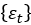

  
**第六届“中国软件杯”大学生软件设计**

**民航机票代理市场的预测及可视化**  

   
团队名称:  fly me to sky

   
团队成员:  汪浩港 王加琪 陈龙

   
指导老师:  袁冠

   
学 校:  中国矿业大学

   
专 业:  计算机科学与技术

   
撰写日期:  2017年6月30日

[1.问题引出 ](#问题引出)

>   [1.1 赛题简介 ](#赛题简介)

>   [1.2 赛题业务场景 ](#赛题业务场景)

[2.需求分析 ](#需求分析)

>   [2.1 功能性需求 ](#功能性需求)

>   [2.2 非功能性需求 ](#非功能性需求)

[3.核心思路阐述 ](#核心思路阐述)

>   [3.1 数据预处理 ](#数据预处理)

>   [3.2 计算每个代理人的市场地位 ](#计算每个代理人的市场地位)

>   [3.3 建立AR模型预测未来的数据 ](#建立ar模型预测未来的数据)

[4.算法模型 ](#算法模型)

>   [4.1 pagerank市场地位计算模块 ](#pagerank市场地位计算模块)

>   [4.2 自回归模型(AR Model) ](#自回归模型ar-model)

[5.系统总体架构 ](#系统总体架构)

>   [5.1 前端模块分析 ](#前端模块分析)

>   [5.2 后台模块分析 ](#后台模块分析)

[6.设计与编码 ](#设计与编码)

>   [6.1 数据库搭建模块 ](#数据库搭建模块-1)

>   [6.2 数据预处理模块 ](#数据预处理模块-1)

>   [6.3 销售数据预测模块 ](#销售数据预测模块-1)

>   [6.4 市场地位计算模块 ](#市场地位计算模块-1)

[7.总结 ](#总结)

1.问题引出

==========

1.1 赛题简介
------------

本队选题为民航机票代理市场的预测及可视化,本题要求参赛选手应用大数据技术，分析机票销售的统计数据，完成民航机票代理市场建模、刻画机票代理画像、对市场演化作出预测、并以直观生动的形式动态展示演化过程及结果。

1.2 赛题业务场景
----------------

因民航机票具备商品属性，与一般商品类似，具有销售网络、分销商等概念。机票分销商在民航领域被称为“航空客运销售代理人”，简称“机票代理人”（从事航空客运销售代理业务的企业法人，而非自然人）。

民航机票又不同于一般商品，导致机票市场的复杂性和特殊性，其结果是旅客既可以在航空公司官网订票（直销），也可以通过各式各样的分销渠道（代理人）进行购票，比如线下的旅行社、机票售票点，线上的OTA（Online Travel Agent，在线旅行社）携程、去哪、飞猪等等。而旅行社、机票售票点、OTA并非全部直接向航空公司购买机票，也存在通过其他的代理人购买的情况。

可见民航机票销售市场关系错综复杂，简单的统计报表有时不能很好的揭示市场演化规律。再加上航空公司纷纷取消代理人售票佣金（即代理人利润式微）、OTA越来越有话语权等各种因素，机票销售市场也在面临洗牌和重组。

因此，本题希望通过分析机票销售的统计数据，对机票代理市场建模。进而刻画机票代理画像——设计指标评估代理人在全市场和各航空公司的市场地位。应用大数据技术对市场的演化作出预测，如代理人的市场地位升降等，以此可指导航空公司的销售策略或帮助行业管理部门进行行业管理决策。

2.需求分析

==========

2.1 功能性需求
--------------

### 2.1.1 指标要求

设计若干指标，能够反映当前一个代理人在全市场和各航空公司的市场地位，例如：代理人在全市场和各航空公司的销售额、销售量，活跃度、图论中的入度/出度/PageRank等等（不强制要求用图论算法）。

本队采取以下指标作为评价代理人市场地位的标准:

**销售额,销售量,图论中的pagerank,图论中的入度,出度.**

### 2.1.2 算法功能

设计算法，预测未来的“功能需求1中的指标”，并能够反向计算出未来一个代理人在全市场和各航空公司的销售额、销售量等。对类型O的每个实体，计算未来每天的，对应每个有交易关系的类型C、O的实体的卖出数量和金额，以及每日的汇总销售数量和金额。

**输入与输出存储格式**

逗号','分隔，编码为UTF-8，换行符为LF（\\n）

day_id,sale_nbr,buy_nbr,cnt,round

日期编号，卖出方代码，买入方代码，数量，金额

**输入数据:代理人3个月内的交易数据**

卖出方和买入方又分为3种类型：

以'C'开头的表示类型为C，代表“航空公司”，只可以卖出，不可以买入；

以'O'开头的表示类型为O，代表“代理人”，既可以卖出，也可以买入，并且允许自己卖给自己（简单来讲：每个“代理人”代码可能对应多个售票点，售票点之前有交换票的情况，所以体现为自己卖给了自己）；

'PAX'表示类型为PAX，代表“旅客”，只可以买入，不可以卖出。

**输出数据:代理人未来1个月内的交易数据**

比如说预测的day_id为10，对于O100，历史上与O100有交易关系的全部实体有：C100，C101，C102，O100，O201，O202，PAX，那么输出数据样例为

day_id,sale_nbr,buy_nbr,cnt,round

10,C100,O100,10,1000

10,C101,O100,10,1000

10,C102,O100,0,0

10,O100,O100,0,0

10,O100,O201,10,1000

10,O202,O100,10,1000

10,O100,PAX,20,2000

### 2.1.3 可视化功能

代理人市场地位的可视化：以图、表等方式直观展示代理人市场地位的演化过程，动态、可交互更佳，形式不限。

2.2 非功能性需求
----------------

### 2.2.1 精度需求

代理人市场地位指标的计算粒度到天，即每天有一个值。每一个代理人每一天都有很多行数据,每一行数据显示了代理人作为买入方或卖出方的交易信息.

### 2.2.2 算法效率需求

代理人市场地位指标的计算时间在10分钟内；市场地位预测的计算时间在30分钟内（使用目前主流计算机配置，样本数据量在百万级，数据时间范围3-6个月，预测时间范围为1个月，具体以样本数据为准）。

我们组采用了多进程的方式跑ar算法,并且优化了许多操作,可以在8分钟内做完所有工作.

### 2.2.3 预测准确性需求

预测的准确性包括误差率、趋势准确性等（以赛题提供的测试工具为准）。

图1-有效数据图

“关系”（或“边”）是指一对 sale_nbr 和 buy_nbr，例如 C1 和
O1，这个关系或边是有方向的。“训练集中的关系”和“测试集中的关系（实际值）”合在一起构成全体数据中的关系。因为原有关系会消亡、也存在新产生的关系，“训练集中的关系”和“测试集中的关系（实际值）”并不相等。

本题不要求预测新关系的产生，每个参赛学生的预测结果范围也不尽相同，因此用第三个圆表示“预测结果中的关系”，画出维恩图表示所有可能的情况。

第1部分“有效数据”，为图中3个集合的交集，分别计算cnt和round两个字段的MAE（平均误差）和MAPE（平均相对误差）。

第2部分“用0填充后”，为图中用橙色线圈出的部分，用0填充预测结果中没有包含到的关系对应的cnt和round值，分别计算cnt和round两个字段的MAE和MAPE。

3.核心思路阐述

==============

3.1 数据预处理
--------------

1. 读取原始数据*.csv,先过滤掉有某列值为空或0的记录。统计总数据条数,代理人总数,交易对数(比如O123和O321发生了交易,不论多少次,只算作一对)等指标,对数据整体有一个初步认识。统计所有交易对在原数据时间范围内的交易情况，得到两条时间序列，分别对应这段时间内的销售量和销售额，如果某天这一对之间没有发生交易，则销售量和销售额为0，销售量序列中的单个值对应当天这对买卖双方之间发生的交易量，交易额序列同理对应交易额

2. 过滤掉在原始数据天数范围内出现次数小于阈值的交易对.阈值的大小需要根据实际情况进行调整,我们暂时将该阈值设为总天数的1/9,考虑这样的实际情景,假设O123和O321在91天内只有8天发生了交易,我们认为这样的交易对难以预测,因为过于稀疏,所以我们先将这些交易对存储起来,不做预测.

3. 将清洗后的数据存入python的pandas.DataFrame数据类型对象中，并存储为.h5文件，以便之后读取使用。同时将所有时间序列存入numpy.ndarray数组中，存储为.npy文件。

3.2 建立AR模型预测未来的数据
----------------------------

1. 此时用户已经给出预测起始时间和终止时间。读取之前生成的.npy文件，取出数组中的每一条时间序列。  
2. 对每一条时间序列单独处理，建立AR模型，使用起始时间前的数据训练模型，用训练好的模型预测起始时间到终止时间间的数据。

3. 每预测出一组,就要放入数组中,在存入之前要检测数据的合理性,将交易量和交易额改为大于0的整数.

4. 将生成的数据汇总处理，按照标准格式输出成与原始数据同样格式的.csv文件。对生成的预测数据集做评价,使用官方提供的模块来检测模型的合理性,根据指标调整参数.

3.3 计算每个代理人的市场地位
----------------------------

1. 根据要处理的天数，如果处理预测起始时间之前的数据就读取原始数据集，否则读取之前生成的预测数据集.

2. 依次取出每一天的交易数据.将sale_nbr作为起点,buy_nbr作为终点,连接一条有向边,销售额和销售量作为这条边的权值.

3. 调用pagerank算法计算每一个代理人的pagerank值,得到该天所有代理人的pagerank值,pagerank的大小排名作为当天的代理人市场地位排名.

4.算法模型

==========

4.1 pagerank市场地位计算模块
----------------------------

### 4.1.1算法思想

PageRank是Google创始人Larry Page和Sergey
Brin于1997年提出的链接分析算法，是对搜索引擎搜索结果的重要性进行排序的重要算法。这种算法借鉴了学术界评判论文重要性的通用方法——论文的引用次数。

PageRank的核心思想非常简单：如果一个网页被很多其他网页链接到，说明这个网页比较重要，
PageRank值会相对较高；如果一个PageRank值较高的网页链接到一个其他的网页，那么被链接到的网页的PageRank值会相应地因此而提高。

图2-pagerank算法关系链

如图所示，链向网页E的链接远远大于链向网页C的链接，但是网页C的重要性却大于网页E。这是因为网页C被网页B所链接，而网页B有很高的重要性，在我们的项目中，代理人的pagerank值就代表代理人的重要性，也就代表代理人的市场地位。

### 4.1.2算法步骤

假设一个由只有4个页面组成的集合：A，B，C和D。如果所有页面都链向A，那么A的PR（PageRank）值将是B，C及D的和。

继续假设B也有链接到C，并且D也有链接到包括A的3个页面。一个页面不能投票2次。所以B给每个页面半票。以同样的逻辑，D投出的票只有三分之一算到了A的PageRank上。

换言之，根据出度平分一个页面的PR值。

实际的网络超链接环境没有这么理想化，PageRank会面临两个问题：Rank Leak和Rank
Sink。

有的网页没有外出的链接，则经过迭代PageRank都会变成0，造成等级泄露，如下图中网页C所示。

我们可以设定其对所有的网页（包括它自己）都有出链，则上图中A的PR值可以表示为：

有的网页只有对自己的出链，或者几个网页的出链形成一个环。那么在迭代过程中，这一个或几个网页的PR值将只会增加，显然不合理。如下图所示：

想象一个随机浏览网页的人，到达C网页后，不会一直停留在C网页，假定他有一个确定的概率直接跳转到一个随机的网页，并且跳转到每个网页的概率相等，则上图中A网页的PR值可以表示为：

一般情况下，一个网页的PR值用以下公式计算：

其中Mpi是所有对pi网页有出链的网页集合，L(pj)是网页pj的出链数目，N是网页总数，α一般取0.85。根据上式，可以计算出每个网页的PR值，在不断迭代趋于平稳时，可认为是最终结果。

### 4.1.3算法实现

本题目中可以将每个代理商视作一个节点，代理商之间的销售关系视作出链入链，则可以套用网页排名中的PageRank算法来评估代理商的市场地位。可以认为与市场地位比较高的代理商发生大量交易的代理商也具有较高的市场地位。

4.2 自回归模型(AR Model)
------------------------

### 4.2.1 模型原理

在AR模型中，序列的当前值由序列
的当前值和序列
的前一个长度为M的窗口内序列值决定。

自回归过程是一个变量在时间的某一点的变化，相对于前期的变化是线性的。一般来说相关性随着时间呈指数下降，且在比较短的周期内消失。

在高频的时间序列中（如日交易），因为数据是最基本的交易数据，而且交易者相互影响，所以通常显示明显的自回归倾向。可以预期这个性质，因为高频率数据是基本的交易数据，而交易者的确相互影响。但是，如果以周或者月为周期，这个过程就会减少，因为当时问区间加长时，来自交易的相关作用降低。

### 4.2.2 算法步骤

如果时间序列
是平稳AR序列，根据此序列的一段有限样本值对的模型进行统计，称为自回归模型拟合

自回归模型拟合主要包括：

(1) 判断自回归模型AR的阶数；

(2) 估计模型的参数；

(3) 对拟合模型进行检验。

#### 4.2.2.1 AR(p)模型的参数估计

目的：为观测数据建立AR(p)模型

假定自回归阶数p已知，考虑回归系数
和零均值白噪声
的方差的估计。
数据

的预处理：如果样本均值不为零，需将它们中心化，即将它们都同时减去其样本均值，再对序列按公式的拟合方法进行拟合。

对于AR(p)模型，自回归系数由AR(p)序列的自协方差函数
通过Yule-Walker方程

唯一决定，白噪声方差由决定。

实际应用中，对于较大的p,为了加快计算速度可采用如下的Levison递推方法

递推最后得到矩估计

上式是由求偏相关函数的公式导出：

#### 4.2.2.2 AR(p)模型的定阶

偏相关函数的分析方法：

一个平稳序列是AR(p)序列当且仅当它的偏相关函数是p步截尾的。如果p步截尾：当时，而，就以作为p的估计。

#### 4.2.2.3 拟合模型的检验

现有数据，欲判断它们是否符合以下模型

式中被假定为独立序列,且,与独立。

原假设H0：数据
符合AR(p)。故在 H0 成立时，下列序列为独立序列

的一段样本值序列。

步骤：

1. 首先，根据公式计算出残差的样本自相关函数.

2. 利用关于独立序列的判别方法，判断
否为独立序列的样本值

3. 根据判断结果，如果接受它们为独立序列的样本值，则接受原假设，即接受符合AR(p),否则，应当考虑采用新的模型拟合原始数据序列。

### 4.2.3 算法实现

因为每一对交易对象的销售额和销售量具有一定的稳定性和增长性，且与前几次的交易具有一定的关联性，因此可以采用时间序列方法对其建立预测模型。首先要做的是差分,因为很多交易对的多天的交易数据是非平稳的,先差分使其平稳,然后使用已知的数据训练ar模型，用于预测。

5.系统总体架构
==============

本系统采用javaweb与python结合开发,开发环境为macOS，在Linux
Ubuntu16.04环境下成功部署,开发语言为python2.7和java,使用了anaconda中的很多科学计算包.前端页面采用html+css+js开发,其中数据可视化部分使用了echarts库.

其中javaweb部分主要用来搭建web网站,进行前端与后台的数据传递,python部分则主要用来进行科学计算,他们两者通过一个java中的线程来配合使用,java通过命令行启动一个python的进程,主程序调用各个模块进行市场地位的计算,销售预测的计算等,将计算结果保存在文件里,javaweb通过访问文件来得到结果并传递给前端.

图-系统整体架构

5.1 前端模块分析
----------------

### 5.1.1 数据上传模块

该模块主要负责数据的上传,工作人员需要把历史数据的csv文件或txt文件导入,并输入要预测的起始天数,就开始上传数据给后台.

### 5.1.2 数据概览模块

该模块主要负责数据的概览,将上传的数据做一个整体的分析,包括总代理人数量,总交易对数,总数据量,数据总天数等指标,给人一个感性的认识.

图-数据概览

### 5.1.3 数据可视化模块

选择某个代理人,将以折线图、柱状图和表格显示代理人各指标在日期区间内的演化过程.

图-代理人O5234的91天销售额折线图

图-代理人O5234的91天销售额柱状图

选择某个日期,将以表格的形式展现这一天排名进500的代理人排名、销售额或销售量.

图-第三天的前五百名代理人和各项指标

5.2 后台模块分析
----------------

### 5.2.1 数据表搭建模块

为了方便管理和操作数据,我们将搭建用户上传输入读入pandas.DataFrame,得到数据表,共5列，与用户上传的csv文件中的列一一对应，并去除有无效数据的行。

### 5.2.2 数据预处理模块

在预处理模块中,我们要对数据表中存储的数据做一个整体的分析概览,包括总天数,交易总对数,总代理人数等等,将数据传给前端,并且过滤掉一些无用数据。对数据的过滤主要以交易双方出现的频数为依据。同时还得到了，每对交易对的两条时间序列，对象交易量和交易额。

### 5.2.3 市场地位计算模块

在市场地位计算模块中,对每一天的销售数据单独考虑，以卖方为起点，买方为终点，交易额为权值建立带权有向图，使用pagerank算法对图进行计算，得到每个点，即每个对象（民航，代理人或旅客)的pagerank值，将所有代理人取出，根据pagerank值排序，得到当天的市场地位。

### 5.2.4 销售数据预测模块

在销售数据预测模块中,我们要使用一个预测模型来对其进行预测,我们有以下几种尝试:ARIMA,AR,LSTM,几种模型的效率,准确率各不相同,最后我们组选了AR模型来做预测,由于赛题要求在10分钟内跑出结果,受制于个人计算机的性能问题,LSTM难以跑出结果,最后失败告终,我们选择了AR模型进行预测,效率非常高,相对而言预测准确率要稍差一些，但最终的结果显示效果并不差.

6.设计与编码
============

6.1 数据存储模块和预处理（使用pandas.DataFrame）
------------------

1.数据表结构

表-交易表
<table>
	<tr>
		<th>字段名</th>
		<th>字段类型</th>
		<th>字段含义</th>
	</tr>
	<tr>
		<th>day_id</th>
		<th>int</th>
		<th>天数</th>
	</tr>
	<tr>
		<th>sale_nbr</th>
		<th>str</th>
		<th>卖方</th>
	</tr>
	<tr>
		<th>buy_nbr</th>
		<th>str</th>
		<th>买方</th>
	</tr>
	<tr>
		<th>cnt</th>
		<th>int</th>
		<th>销售量</th>
	</tr>
	<tr>
		<th>round</th>
		<th>int</th>
		<th>销售额</th>
	</tr>
</table>

表-代理人表
<table>
	<tr>
		<th>字段名</th>
		<th>字段类型</th>
		<th>字段含义</th>
	</tr>
	<tr>
		<th>day_id</th>
		<th>int</th>
		<th>天数</th>
	</tr>
	<tr>
		<th>rank</th>
		<th>int</th>
		<th>排名</th>
	</tr>
	<tr>
		<th>agent_id</th>
		<th>str</th>
		<th>代理人编号</th>
	</tr>
	<tr>
		<th>sum_cnt</th>
		<th>int</th>
		<th>当天总销售量</th>
	</tr>
	<tr>
		<th>sum_round</th>
		<th>int</th>
		<th>当天总销售额</th>
	</tr>
	<tr>
		<th>indep</th>
		<th>int</th>
		<th>代理人作为买方发生的交易数量</th>
	</tr>
	<tr>
		<th>outdep</th>
		<th>int</th>
		<th>代理人作为买方发生的交易数量</th>
	</tr>
	<tr>
		<th>pagerank_value</th>
		<th>float64</th>
		<th>代理人当天的pagerank值</th>
	</tr>
</table>

2.模块方法

表-数据库搭建模块步骤
<table>
	<tr>
		<th>步骤名</th>
		<th>功能</th>
	</tr>
	<tr>
		<th>read_csv</th>
		<th>读取被上传的原始数据</th>
	</tr>	
	<tr>
		<th>delete_invalid</th>
		<th>删除不合法的数据行</th>
	</tr>
	<tr>
		<th>filtrate</th>
		<th>统计交易对和对应的交易量、交易额时间序列，并过滤稀疏交易对</th>
	</tr>
	<tr>
		<th>statistics</th>
		<th>得到数据概要模块需要的数据</th>
	</tr>
</table>

1. 先删除销售额或销售量为0的记录，之后通过查询得到所有的交易关系，就是以一对买卖双方作为对象考虑，一共有多少种对象。对每一个对象进行统计频数，就是这一对买卖双方在数据集范围内交易的次数，次数太少就以为着对预测和评估的意义小，为简化后续计算将其过滤，这里以10次为阈值。得到有效交易集合

6.3 销售数据预测模块
--------------------

表-销售数据预测模块
<table>
	<tr>
		<th>方法名</th>
		<th>功能</th>
	</tr>
	<tr>
		<th>evaluate_ar_model</th>
		<th>对每一条时间序列的后续数据进行预测（并行计算）</th>
	</tr>	
	<tr>
		<th>output_to_csv</th>
		<th>将预测结果汇总以标准格式写入csv文件</th>
	</tr>
</table>

1. 对一种有效交易关系，统计他在数据集范围内发生的交易，如果某一天没有发生交易，交易量和交易额都填0，于是每一个对象得到两个时间序列，分别对应交易量和交易额。

2. 对得到的所有时间序列，使用自回归（AR）模型预测未来一段时间的数据。

3. 我们当做每一个序列都是没有关系的，所以可以并行计算，加快预测速度。

4. 最后将生成的预测数据汇总，以要求格式输出为csv文件。

6.4 市场地位计算模块
--------------------

表-市场地位计算模块
<table>
	<tr>
		<th>方法</th>
		<th>功能</th>
	</tr>
	<tr>
		<th>work_for_pr</th>
		<th>使用pagerank为某一天进行计算</th>
	</tr>	
	<tr>
		<th>output_to_csv</th>
		<th>将第一步的结果汇总以标准格式写入csv文件</th>
	</tr>
	<tr>
		<th>create_table</th>
		<th>创建数据表DataFrame,读入上一步生成的.csv文件</th>
	</tr>
	<tr>
		<th>to_hdf</th>
		<th>将数据存为.h5文件</th>
	</tr>
</table>

1. 对每一天单独进行计算，各天之间没有关系，也并行化计算。

2. 对于某一天，先判断这一天的数据在原数据集中还是在预测数据集中，取出这一天的所有数据，以卖方到买方为有向边，交易额为边的权值，建图，使用python模块networkx中的pagerank方法对其进行计算，得到每个对象的pagerank值，只看以O开头的代理商，以pagerank值降序排序得到当天的排名。

7.总结
======

7.1 项目创新点
--------------
1. 我们使用java和python混合开发，充分利用了各自的优点，java的用途广泛，用于web开放后端语言十分实用，而python的易用和在数据处理上的优势也促使我们选择了它。项目以java为基础，java与python是通过命令行与文件交互的，java通过命令行“python *.py [args]"，执行一个脚本，而后又可以读取python执行生成的文件获取所需数据反映到前端。
2. 本题目标为预测，难度较大，而数据有很庞杂，但数据之间的关联并不是那么紧密，某一天的数据或者某一对买卖双方对应的数据，在某个计算模块中是可以单独拿出来看的。所以我们使用了大量的并行化计算，来提高计算效率，具体如下：

 (1) 在过滤数据阶段，得到各个交易关系的交易量时间序列和交易额时间序列的过程是并行的，在python中使用多个进程同时计算，每个进程对单个交易关系统计。

 (2) 在预测阶段，每个交易序列也用一个进程进行处理预测，同时进行多个序列的计算。

 (3) 在指标计算阶段，每一天的数据也是单独用一个进程处理，同时进行多天的计算。

7.2 项目难点
---------------
1. 本题的数据是三维数据，要考虑时间，时间序列预测一直是机器学习领域的难题，有很多方案，各有优劣，有的模型简单，但预测准确性欠佳,而复杂的模型往往计算量大很多。在实验了多种方法，如AR、ARIME、LSTM等后，我们决定使用简单模型，进行多次计算，将原始数据以交易对为单位处理成多组数据，将大问题细化，变成极多的小问题，每个问题独立，并行处理，从而达到预计时间要求。经测试，预测效果也好于预期。

7.3 结语
---------------
	
在项目过程中我学习了很多新知识，java和python的技能树都得到了较好增长，  
顺便还学习了docker这个神器。在此感谢大赛给了我这个锻炼的平台。
	感谢您的阅览。